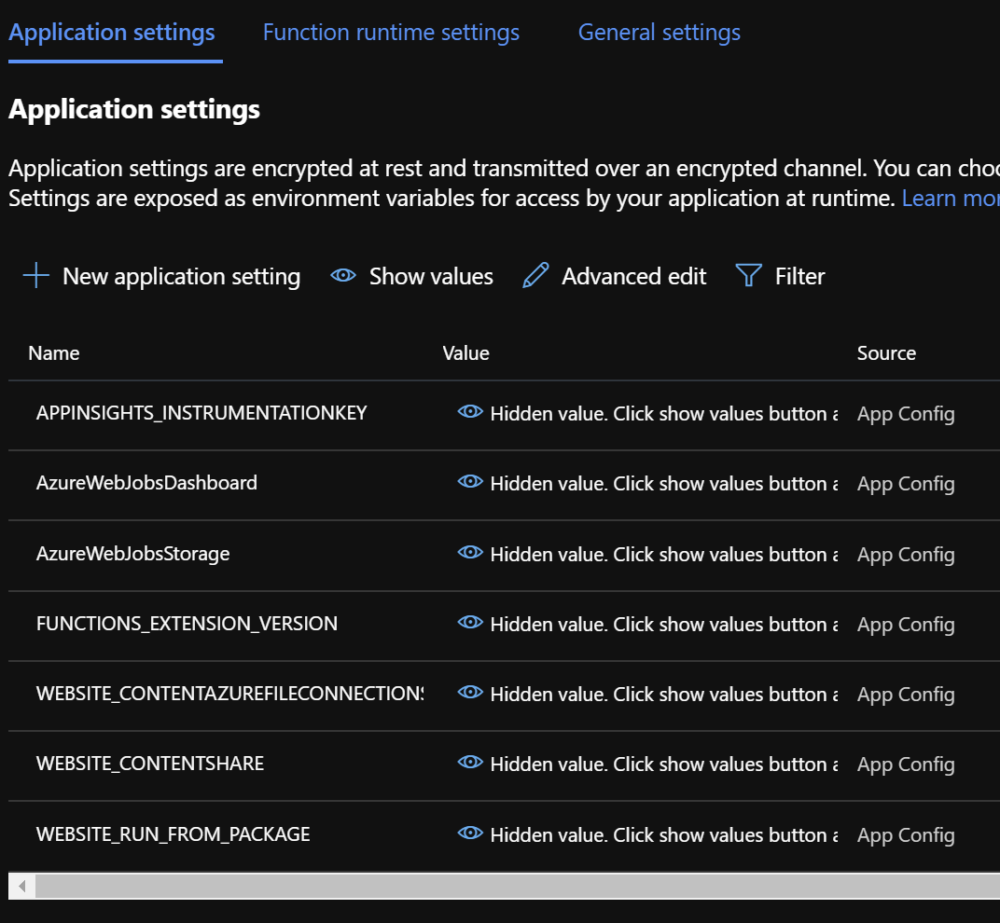
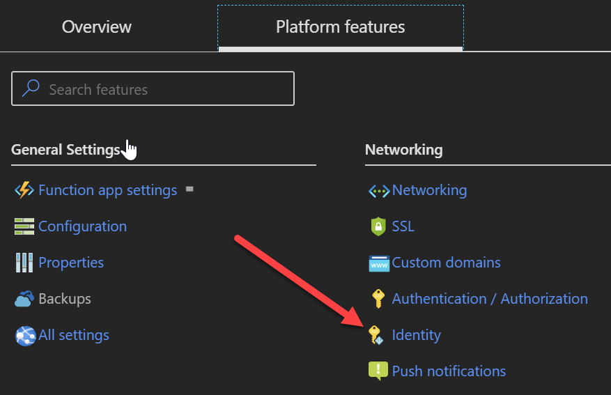
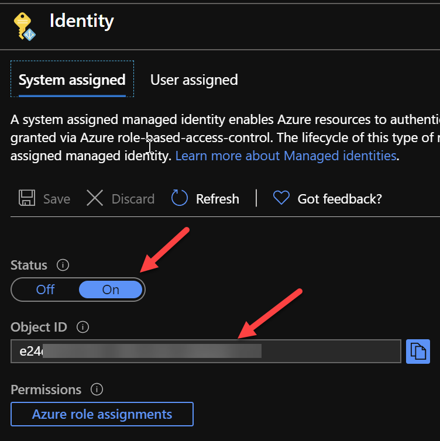
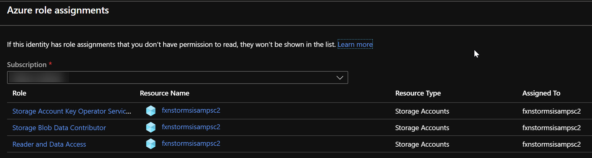
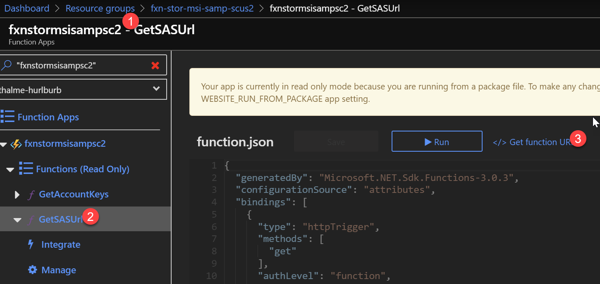
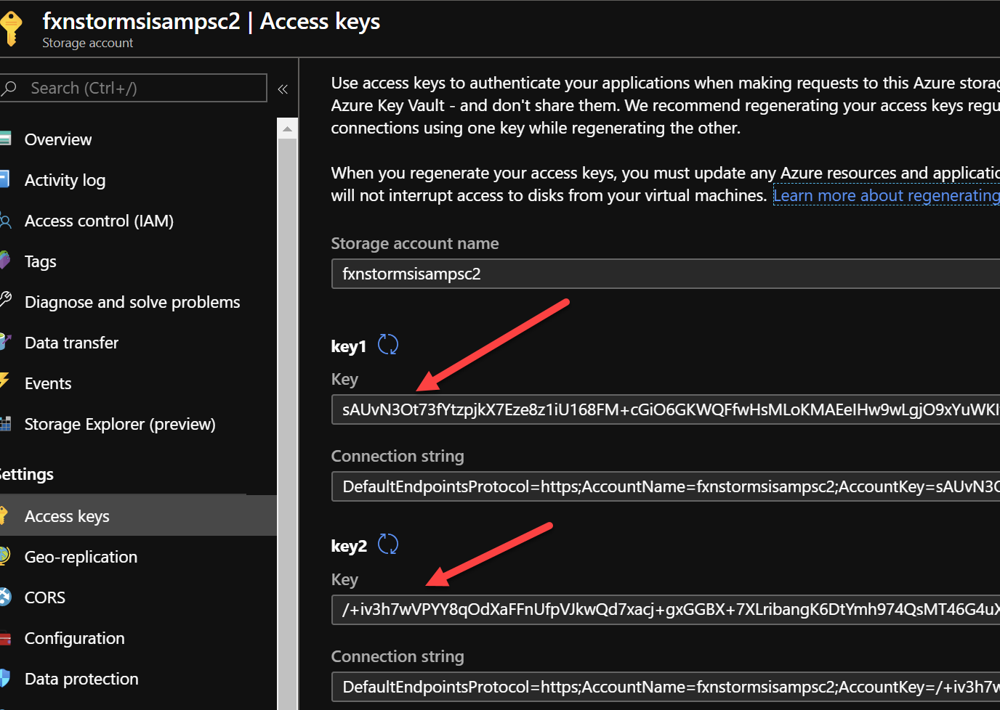

# Using Managed Identity between Azure Functions and Azure Storage

In this sample you'll learn how you can rid yourself of all the cumbersome connection strings that often come with interacting with Azure Storage accounts. Instead, a more secure and recommended approach is to allow Azure Active Directory (AAD) to control this access by assigning actual AAD identities to your service resources and controlling access via Role Based Access Control (RBAC).

This sample shows how to deploy your Azure Resources using [Terraform](https://terraform.io), including system-assigned identities and RBAC assignments, as well as the code needed to utilize the Managed Service Identity (MSI) of the resulting Azure Function. In addition, the Function provides the ability to generate a read-only SAS URL to a blob, regenerate keys, and list keys for the created Storage Account. The generated SAS URL is valid for only one minute and can be completely invalidated by issuing the regenerate keys command.

## Running the sample

### Install prerequisites
For ease of use, this sample includes a [Visual Studio Code Dev Container](https://code.visualstudio.com/docs/remote/containers) which you can build locally and run within, which provides all the tooling needed to build & deploy the included code. If you do not have VSCode, or wish to build & deploy without the use of containers, you need these pieces of software on your local machine:

- [.Net Core 3.1 SDK](https://dotnet.microsoft.com/download)
- [Azure Functions Core Tools v3](https://docs.microsoft.com/en-us/azure/azure-functions/functions-run-local?tabs=windows%2Ccsharp%2Cbash#install-the-azure-functions-core-tools)
- [Azure CLI](https://docs.microsoft.com/en-us/cli/azure/install-azure-cli?view=azure-cli-latest)
- [Terraform CLI](https://www.terraform.io/downloads.html)

Alternatively, [Visual Studio 2019](https://visualstudio.com) comes with both the .Net Core 3.1 SDK and the Functions Core Tools and you can use it to publish the Function App from the IDE.

### Deploy resources to Azure

To deploy the resources, perform the following commands at a command line:

```
az login
az account set --subscription <target subscription ID>
cd terraform
terraform apply --var basename="<a base name for your resources, e.g. 'bhfxnmsisamp'>" --var resource_group_name="<resource group to create & deploy to>" --var location="<Azure region to deploy, defaults to West US if not specified>"
```

Where `basename` and `resource_group_name` are required parameters, and `location` will default to `West US` if left unspecified.

Alternatively, you can create a `local.tfvars` file in the `/terraform` directory which looks like:

```
basename="fxnstormsisampsc2"
resource_group_name="fxn-stor-msi-samp-scus2"
location="South Central US"
```

and can be utilized by doing `terraform apply -var-file local.tfvars`

### Deploy Function App to Azure

After deployment completes, a `deploy.app.sh` file is created which can be executed within a bash shell. This will fully deploy the Function App to Azure.

> Note: If you have multiple Functions Core Tools versions installed (e.g. v1, v2, v3) the `func azure functionapp publish` call may fail as it will pull `func.exe` from your path which may not be the v3 one. In this case, it's far easier to use the included dev container to execute at least the build & deploy of the Function App

### Upload a blob to storage

You can now connect to the storage account _without the `fx` suffix_ where you will find a `sample` container. Upload a blob of your choice in to this container.

### Observe the configuration of the Function App

In the past, creating a solution like this would mean adding a `MyStorageConnectionString` application setting to your Azure Function which would contain the primary or secondary connection string of the target storage account. However you'll notice, if you observe the Function App you just deployed to Azure, there is no such connection string:



> Note: The one connection string you _do_ see here is for the backend storage of your Azure Function, where its .zip package is uploaded when you publish

This is because the permission and connectivity to the target storage account is controlled by the Identity and RBAC assignments in your associated Active Directory. You can see the identity of your Function by going to its 'Identity' area under 'Platform features':





If you click the `Azure role assignments` button, you'll even see its assignment and permissions to the storage account:



These pieces together comprise the entirety of the scope of access your Function App has to the Storage Account. In the past, when we used Connection Strings, it gave the Function app *total control* over the storage account. Using RBAC allows finer-grained control over what the Function App can do. Additionally, if we roll the keys on the storage account, we need not restart the Function App to start using the new keys as we would in the past (as we'd have had to update the connection string or the value in KeyVault if using a KeyVault App Setting reference). Rolling keys, however, would immediately negate any and all SAS URLs this Function generates.

### Execute the Functions

#### Generate a SAS URL

At the command line, run the following:

```
curl --location --request GET 'https://fxnxxxxxx.azurewebsites.net/api/GetSASUrl?code=3TR6xxxxxx&blobUri=https://fxxxx.blob.core.windows.net/sample/my.file'
```

Where the URL is what your function app showed for its HTTP Trigger value after it deployed. If you missed this, you can get it from the portal here:



Then, add a new URL parameter `blobUri` that is the full http URL to your target blob. It will look something like this:

`https://<basename from deployment>.blob.core.windows.net/sample/<filename you uploaded>`

**Response**

```
https://fxn_____.blob.core.windows.net/sample/my.file?skoid=......pxLSpVwuML%2B3UXrxBmC6XGA%3D
```

You can paste this URL right into an InPrivate browser; you'll be able to download the Blob no problem!

#### Get the Account Keys for storage

Sometimes, when interacting with 3rd party SDKs in particular, you must instead give it the account key for a storage account. In this case it's useful for the Function to be able to obtain & return the fully account key for a storage account. You can test this with the following call to your function:

```
curl --location --request GET 'https://fxnxxxxxxx.azurewebsites.net/api/GetAccountKeys?code=GKUxxxxxxxx&accountName=fxnxxxx'
```

where the `accountName` URL parameter is the name of the target storage account you created. This should be equivalent to the `basename` variable you passed to Terraform. 

The response will look like:

```json
[
    {
        "keyName": "key1",
        "value": "2xl________",
        "permissions": "Full"
    },
    {
        "keyName": "key2",
        "value": "NV3________",
        "permissions": "Full"
    }
]
```

#### Regenerate a storage key

As part of normal security protocol, it's common to regenerate the keys for storage accounts. Additionally, being able to do this if you detect a breach of security is vitally important.

In this deployment, it's easy to do. 

First, open the Access Keys pane of the target storage account, so you can see the value before & after this call



Now, make the following call to your function:

```
curl --location --request POST 'https://fxnxxxxxx.azurewebsites.net/api/RegenerateKey?code=9OZxxxxx&accountName=fxnstormsisampsc&keyName=key2'
```

The response will simply be a 200 OK, but now refresh the view of your storage account, watching `key2`'s value closely. You'll see it has changed. This change not only affected anybody using key2's value as an Account Key (like a 3rd party SDK), but also invalidated any SAS URLs generated with it. In our case we generate SAS URLs with `key1` and have them expire in 1 minute.

To prove this regeneration invalidates a SAS URL, execute tasks 1 and 3 in succession and test the SAS URL given by task 1 at the end; you'll be given an error.

In the past if we rotated these storage keys, we'd have to update connection strings in the Function App's Application Settings which would end up doing a "soft restart" of the Function app, or we'd have to update the value in Key Vault if we were using Key Vault references and restart the Function App manually.

## Reviewing the code

In this sample we're using the latest versions of all available Nuget packages to interact with the Data and Management planes of Azure Storage & Functions.
Unfortunately - at the time of this writing - these SDKs do not share credential objects which complicates how we are able to utilize credentials for the Function App between the two surfaces. In addition, the local development story also injects a level of complexity. So let's review the code and how it works:

### How we obtain local (user) and Azure (MSI) credentials within the Function

You can see the usage of `DefaultAzureCredential` in our code [here](src/Functions.cs#L28). [Per the documentation](https://docs.microsoft.com/en-us/dotnet/api/azure.identity.defaultazurecredential?view=azure-dotnet), this looks for credentials in the Environment, then MSI, then a Shared Token Cache (populated by Visual Studio), and finally prompting for _interactive login_ to obtain them. Yes, if you run this code locally a browser opens prompting you to log in to Azure! However, when pushed out to the cloud, it will stop at the MSI portion as it will successfully obtain a credential there.

> Note: Attempting to run from _within_ the dev container will fail. The SDK requires access to a browser to pop the login screen, and the dev container has no way to call out to host OS and back in (yet). If you require this workflow, you'll need to create a full Service Principal in Azure which your developers will use to do local development. You will utilize the SP's credentials via [Environment Variables](https://docs.microsoft.com/en-us/dotnet/api/azure.identity.environmentcredential?view=azure-dotnet) (Client_Id, Client_Secret in addition to Tenant & Subscription) you set in `local.settings.json` which are picked up by the Environment Credential loader step of the Default Credential instance.

That's all there is to implementing this credential in your code - pretty easy.

This identity is then utilized by the BlobServiceClient which actually makes the calls. This is instantiated [here](src/Functions.cs#L21) and used [here](src/Functions.cs#L79).

### Getting the credentials to the management plane SDK

The complex part, then, is getting this credential over to the Management SDK to be used in making the calls to Get and Regenerate Account Keys for the Storage Account. This work is done by our `Lazy<T>` to retrieve an `IAzure` object; the API used to perform these operations. You can see that code [here](src/Functions.cs#L34). Because one user's login could give them access to multiple tenants and/or subscriptions, in order for this code to work locally you need to set `AZURE_TENANT_ID` and `AZURE_SUBSCRIPTION_ID` in your `local.settings.json` file for the Function App (see [sample.local.settings.json](src/sample.local.settings.json) for details, you can simply rename this file to `local.settings.json` and fill in the values to enable local development). You can find these values in the output from the `az login` command you ran earlier.

With that done, the rest of this code block either uses the token credential obtained by `DefaultAzureCredential` to fabricate up both ARM and Microsoft Graph credentials and then build the Management plane interface, or uses the `FromSystemAssignedManagedServiceIdentity` API to use the Managed Identity when running out in Azure.

The management plane is used for key [retrieval](src/Functions.cs#L137) and [manipulation](src/Functions.cs#L175).

## Summary

In this sample you learned how to reduce your connection string storage and management and increase security to your Azure resources by utilizing  Managed Service Identity and Active Directory role-based access control. This sample can be deployed via your DevOps solution of choice (including [Azure DevOps](https://dev.azure.com)) utilizing Terraform actions against your Azure account.